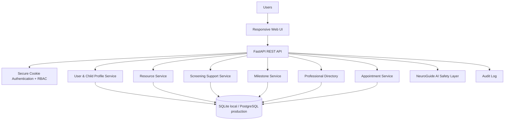
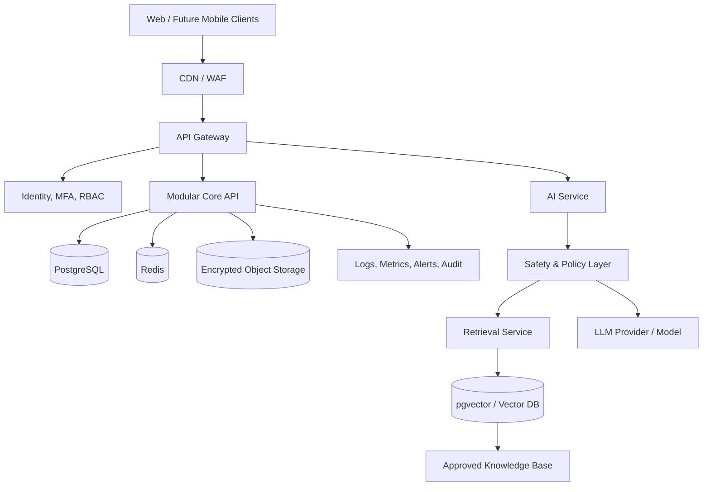

# NeuroConnect 360 — Architecture

## Phase-1 runtime

## Target production architecture

## Safety boundary

NeuroGuide AI and screening-support features are deliberately separated from diagnosis. Any production AI response pipeline should implement approved-source retrieval, citation generation, uncertainty communication, emergency escalation, medical-safety validation, user feedback, and professional governance.

## RBAC

Initial roles: Parent/Caregiver, Professional, Teacher, Researcher, Administrator. The schema is intentionally extensible toward granular Roles/Permissions tables in the full implementation.
